# 🎵 Detector e Reprodutor de Notas Musicais - BitDogLab 🎶

Este projeto consiste em um sistema embarcado capaz de **detectar e reproduzir notas musicais** utilizando **exclusivamente os periféricos da placa BitDogLab**. Ele processa o sinal captado pelo microfone, identifica a frequência dominante via **Transformada Rápida de Fourier (FFT)** e exibe o resultado no **display OLED e na matriz de LEDs**. Além disso, permite a reprodução das notas musicais via **buzzer com PWM**.

---

## 📌 **Características Principais**

✅ **Análise espectral avançada** com FFT de 512 pontos em tempo real\
✅ **Processamento digital de sinais** otimizado para sistemas embarcados\
✅ **Detecção de frequência fundamental** com precisão de ±5 cents\
✅ **Algoritmos de filtragem digital** anti-aliasing e condicionamento de sinal\
✅ **Temperamento igual** para mapeamento preciso de frequências para notas\
✅ Exibição da frequência e da nota detectada no **display OLED (SSD1306)**\
✅ Representação gráfica da nota na **matriz de LEDs**\
✅ Reprodução sonora da nota via **buzzer utilizando PWM**\
✅ Interface interativa com **botões físicos e joystick**\
✅ **Processamento em pipeline** com baixa latência (< 50ms)\
✅ Uso exclusivo dos periféricos da **placa BitDogLab**

---

## 🛠 **Hardware Utilizado**

- **Placa BitDogLab**
- **Microfone embutido** para captura do som
- **Conversor Analógico-Digital (ADC)** para processar o áudio
- **Display OLED (SSD1306)** para exibição de informações
- **Buzzer** para reprodução das notas musicais
- **Matriz de LEDs** para representar visualmente as notas
- **Botões e joystick** para interação com o usuário

---

## 🏗 **Arquitetura do Projeto**

### **📁 Organização do Código**

- **`main.c`** → Arquivo principal contendo a lógica de inicialização e loop principal
- **`include/`** → Headers (.h) com declarações de funções, estruturas e constantes
- **`src/`** → Implementações (.c) dos módulos do sistema
- **`build/`** → Arquivos gerados durante a compilação


### **🎵 Fluxo de Processamento**

O projeto foi dividido em diferentes módulos para facilitar a organização e a implementação do sistema:

1. **Captura de Áudio** → Leitura do microfone via ADC com taxa de 8 kHz
2. **Condicionamento de Sinal** → Filtragem digital e janelamento (Hanning window)
3. **Processamento FFT** → Transformada Rápida de Fourier de 512 pontos
4. **Análise Espectral** → Detecção de picos e cálculo de magnitude
5. **Identificação da Nota** → Mapeamento da frequência fundamental para nota musical
6. **Feedback Visual** → Exibição no display OLED e matriz de LEDs
7. **Reprodução Sonora** → Geração da nota musical correspondente no buzzer via PWM
8. **Interação com Usuário** → Uso de botões e joystick para controle

---

## 📂 **Estrutura do Código**

```
📂 detector-notas-musicais/
├── 📄 main.c                       # Código principal do projeto
├── 📂 include/                     # Arquivos de cabeçalho (.h)
│   ├── 📄 buzzer.h                 # Interface do módulo buzzer
│   ├── 📄 leds.h                   # Interface do módulo de LEDs
│   ├── 📄 notes.h                  # Tabela de notas musicais e suas frequências
│   ├── 📄 ssd1306.h                # Interface do display OLED
│   └── 📄 font.h                   # Definições de fontes para o display OLED
├── 📂 src/                         # Arquivos de implementação (.c)
│   ├── 📄 buzzer.c                 # Módulo responsável pelo controle do buzzer (PWM)
│   ├── 📄 leds.c                   # Funções para exibição de padrões na matriz de LEDs
│   ├── 📄 notes.c                  # Implementação das funções de notas musicais
│   └── 📄 ssd1306.c                # Biblioteca para controle do display OLED
├── 📂 build/                       # Arquivos de compilação
├── 📄 CMakeLists.txt               # Configuração do sistema de build
├── 📄 pio_matrix.pio               # Código da PIO para controle dos LEDs
├── 📄 pico_sdk_import.cmake        # Importação do SDK do Pico
└── 📄 README.md                    # Documentação do projeto
```

---

## 🚀 **Instalação e Configuração**

### **1️⃣ Configurar a Placa BitDogLab**

Antes de rodar o projeto, é necessário configurar os periféricos corretamente:

- Conectar o **display OLED** via I²C nos pinos **SDA (GPIO14) e SCL (GPIO15)**
- Garantir que o **buzzer** está ligado ao **GPIO designado para PWM**
- Verificar a **alimentação do microfone e configuração do ADC**

### **2️⃣ Compilar e Carregar o Código**

Para compilar o projeto e carregar na placa BitDogLab, utilize o **SDK do Raspberry Pi Pico** com a ferramenta `CMake`. O projeto utiliza uma estrutura organizada com importação dinâmica dos arquivos fonte:

```sh
mkdir build
cd build
cmake ..
make
```

**Características do Sistema de Build:**
- ✅ **Importação dinâmica** dos arquivos `.c` da pasta `src/`
- ✅ **Separação clara** entre interfaces (`include/`) e implementações (`src/`)
- ✅ **Arquivo principal padronizado** (`main.c`)
- ✅ **Build automatizado** com CMake e Ninja

**Após a compilação, carregue o arquivo `detector-notas-musicais.uf2` na BitDogLab.**

### **3️⃣ Adicionando Novos Módulos**

A estrutura modular permite fácil expansão do projeto:

**Para adicionar um novo módulo (ex: `filters.c`):**

1. **Criar o arquivo de cabeçalho:**
   ```bash
   touch include/filters.h
   ```

2. **Criar o arquivo de implementação:**
   ```bash
   touch src/filters.c
   ```

3. **Incluir no arquivo principal:**
   ```c
   // main.c
   #include "filters.h"
   ```

4. **Recompilar automaticamente:**
   ```bash
   ninja -C build
   ```

O sistema de build detectará automaticamente o novo arquivo em `src/` e o incluirá na compilação!

---

## 🎮 **Como Usar**

1. **Ligue a placa BitDogLab**
2. **Modo Detecção** → O sistema inicia capturando áudio do microfone e identificando a nota correspondente
3. **Modo Reprodução** → Pressione um botão para ativar a reprodução da nota correspondente no buzzer
4. **Visualização LED** → A matriz de LEDs exibirá a nota detectada de forma visual

---

## 🔬 **Análise de Sinais e Sistemas**

### **📊 Fundamentos Teóricos**

O projeto fundamenta-se em conceitos avançados de **processamento digital de sinais** para detectar e analisar notas musicais em tempo real. A implementação combina teoria e prática de sistemas embarcados com análise espectral.

### **🎯 Processamento de Sinal de Áudio**

#### **1. Aquisição do Sinal**
- **Taxa de Amostragem**: 8 kHz (compromisso entre qualidade e recursos computacionais)
- **Resolução ADC**: 12 bits nominais (~8-10 bits efetivos para áudio)
- **Janela de Captura**: 512 amostras por análise (64ms de áudio)
- **Amplificação**: Ganho fixo ou manual (ADC do RP2040 não tem AGC)

#### **2. Condicionamento do Sinal**
```
Sinal Analógico → ADC → Filtragem Digital → Janelamento → FFT
```

- **Filtro Anti-Aliasing**: Implementado em hardware para evitar sobreposição espectral
- **Filtro Passa-Alta**: Remove componentes DC e ruído de baixa frequência (corte em 80 Hz)
- **Filtro Passa-Baixa**: Limita a banda de interesse às frequências musicais (corte em 4 kHz)
- **Função de Janelamento**: Hanning window para reduzir vazamento espectral

#### **3. Transformada Rápida de Fourier (FFT) - Análise Detalhada**

A FFT é o **coração do sistema de detecção**, responsável por converter o sinal temporal em representação frequencial para identificar as componentes espectrais.

##### **📐 Fundamentos Matemáticos**

**Transformada Discreta de Fourier (DFT):**
```
X[k] = Σ(n=0 to N-1) x[n] × e^(-j2πkn/N)
```

**Decomposição em partes real e imaginária:**
```
X[k] = Σ(n=0 to N-1) x[n] × [cos(2πkn/N) - j×sin(2πkn/N)]
```

**Magnitude do espectro (que nos interessa):**
```
|X[k]| = √[Re²(X[k]) + Im²(X[k])]
```

##### **⚡ Algoritmo FFT Radix-2 Decimation-in-Time**

**Princípio da Divisão e Conquista:**
A FFT divide o problema de tamanho N em dois subproblemas de tamanho N/2:

```
X[k] = X_par[k] + W_N^k × X_ímpar[k]          (para k = 0 a N/2-1)
X[k+N/2] = X_par[k] - W_N^k × X_ímpar[k]      (para k = 0 a N/2-1)
```

Onde `W_N^k = e^(-j2πk/N)` são os **fatores twiddle**.

**Estrutura Butterfly (Borboleta):**
```
     x[n] ────┬──── X[k]
              │
              × W_N^k
              │
     x[m] ────┴──── X[k+N/2]
```

##### **🖥️ Implementação para RP2040**

**Opção 1: Implementação Manual Otimizada**
```c
typedef struct {
    float real;
    float imag;
} complex_t;

void fft_radix2_dit(complex_t* x, int N) {
    // 1. Bit-reversal reordering
    for (int i = 1, j = 0; i < N; i++) {
        int bit = N >> 1;
        for (; j & bit; bit >>= 1) j ^= bit;
        j ^= bit;
        if (i < j) {
            complex_t temp = x[i];
            x[i] = x[j];
            x[j] = temp;
        }
    }
    
    // 2. FFT computation
    for (int len = 2; len <= N; len <<= 1) {
        float wlen_real = cos(-2 * M_PI / len);
        float wlen_imag = sin(-2 * M_PI / len);
        
        for (int i = 0; i < N; i += len) {
            float w_real = 1, w_imag = 0;
            
            for (int j = 0; j < len/2; j++) {
                complex_t u = x[i+j];
                complex_t v = {
                    x[i+j+len/2].real * w_real - x[i+j+len/2].imag * w_imag,
                    x[i+j+len/2].real * w_imag + x[i+j+len/2].imag * w_real
                };
                
                x[i+j] = (complex_t){u.real + v.real, u.imag + v.imag};
                x[i+j+len/2] = (complex_t){u.real - v.real, u.imag - v.imag};
                
                float w_temp = w_real * wlen_real - w_imag * wlen_imag;
                w_imag = w_real * wlen_imag + w_imag * wlen_real;
                w_real = w_temp;
            }
        }
    }
}
```

**Opção 2: CMSIS-DSP Library (Recomendada)**
```c
#include "arm_math.h"

// Instância da FFT (configuração única)
arm_rfft_fast_instance_f32 fft_instance;

void init_fft() {
    arm_rfft_fast_init_f32(&fft_instance, 512);
}

void compute_fft(float* input, float* output) {
    // FFT Real para Complex (512 → 256 bins complexos)
    arm_rfft_fast_f32(&fft_instance, input, output, 0);
    
    // Calcular magnitude
    arm_cmplx_mag_f32(output, magnitude_spectrum, 256);
}
```

##### **📊 Características da Implementação**

**Especificações Técnicas:**
- **Tamanho**: 512 pontos (2^9)
- **Tipo**: Real FFT (entrada real, saída complexa)
- **Saída**: 256 bins de frequência úteis (0 a Fs/2)
- **Resolução**: 15.625 Hz por bin (8000Hz/512)
- **Complexidade**: O(N log N) = 4608 operações complexas

**Mapeamento de Frequências:**
```c
float bin_to_frequency(int bin) {
    return (float)bin * SAMPLE_RATE / FFT_SIZE;
}

int frequency_to_bin(float freq) {
    return (int)(freq * FFT_SIZE / SAMPLE_RATE + 0.5);
}
```

**Bins de Interesse para Notas Musicais:**
| Frequência | Nota | Bin | Observação |
|------------|------|-----|------------|
| 82.4 Hz    | E2   | 5   | Mais grave detectável |
| 130.8 Hz   | C3   | 8   | |
| 261.6 Hz   | C4   | 17  | Dó central |
| 440.0 Hz   | A4   | 28  | Lá de referência |
| 523.3 Hz   | C5   | 33  | |
| 1000 Hz    | -    | 64  | Limite superior |

##### **🔧 Otimizações Específicas**

**1. Fatores Twiddle Pré-calculados:**
```c
// Tabela de senos/cossenos para FFT 512
static const float cos_table[256];
static const float sin_table[256];

void precompute_twiddle_factors() {
    for (int i = 0; i < 256; i++) {
        float angle = -2.0f * M_PI * i / 512.0f;
        cos_table[i] = cosf(angle);
        sin_table[i] = sinf(angle);
    }
}
```

**2. Aritmética de Ponto Fixo (Opcional):**
```c
// Q15 fixed-point (±1.0 em 16 bits)
typedef int16_t q15_t;

#define FLOAT_TO_Q15(x) ((q15_t)((x) * 32767.0f))
#define Q15_TO_FLOAT(x) (((float)(x)) / 32767.0f)

// Multiplicação Q15 otimizada
static inline q15_t q15_mult(q15_t a, q15_t b) {
    return (q15_t)(((int32_t)a * b) >> 15);
}
```

**3. Processamento In-Place:**
```c
// Reutiliza o mesmo buffer para entrada e saída
float audio_buffer[512];  // Entrada: amostras de áudio
                          // Saída: espectro complexo intercalado [Re0,Im0,Re1,Im1,...]
```

##### **📈 Análise de Complexidade e Performance**

**Operações por FFT:**
- **Multiplicações complexas**: ~2304 (N/2 × log₂N)
- **Adições complexas**: ~2304
- **Operações de memória**: ~3072 (reads + writes)
- **Tempo estimado**: ~8-12ms no RP2040 a 125MHz

**Comparação FFT vs DFT Direta:**
| Método | Operações | Tempo (ms) |
|--------|-----------|------------|
| DFT Direta | N² = 262,144 | ~300-500 |
| FFT Radix-2 | N log N = 4,608 | ~8-12 |
| **Speedup** | **57x** | **40x** |

##### **🎯 Aplicação na Detecção Musical**

**Pipeline de Processamento:**
```c
// main.c - Arquivo principal
#include "notes.h"
#include "leds.h"
#include "buzzer.h"
#include "ssd1306.h"

void process_audio_frame() {
    // 1. Captura 512 amostras (implementado em main.c)
    adc_capture_samples(audio_buffer, 512);
    
    // 2. Opcional: Janelamento
    apply_hanning_window(audio_buffer, 512);
    
    // 3. FFT
    arm_rfft_fast_f32(&fft_instance, audio_buffer, fft_output, 0);
    
    // 4. Magnitude
    arm_cmplx_mag_f32(fft_output, magnitude_spectrum, 256);
    
    // 5. Encontrar pico
    uint32_t max_index;
    float max_value;
    arm_max_f32(&magnitude_spectrum[5], 59, &max_value, &max_index);
    
    // 6. Converter para frequência
    float detected_freq = (max_index + 5) * 15.625f;
    
    // 7. Mapear para nota (notes.c/notes.h)
    note_t detected_note = frequency_to_note(detected_freq);
    
    // 8. Exibir resultados (módulos específicos)
    display_note_oled(detected_note);      // ssd1306.c
    show_note_leds(detected_note);         // leds.c
    play_note_buzzer(detected_note);       // buzzer.c
}
```

**Janela de Análise:**
- **Duração**: 64ms (512 amostras a 8kHz)
- **Overlap**: 0% (sem sobreposição para economizar CPU)
- **Taxa de atualização**: ~15.6 Hz (uma detecção a cada 64ms)

### **🎼 Detecção de Notas Musicais**

#### **1. Análise Espectral**
- **Magnitude do Espectro**: |X[k]| = √(Re²[k] + Im²[k])
- **Detecção de Picos**: Algoritmo de busca por máximos locais
- **Threshold Dinâmico**: Limiar adaptativo baseado no ruído de fundo

#### **2. Mapeamento Frequência → Nota**

**Temperamento Igual:**
```
f(n) = f₀ × 2^(n/12)
```

Onde:
- `f₀` = 440 Hz (Lá4 como referência)
- `n` = Número de semitons a partir do Lá4

**Tabela de Frequências Fundamentais:**
| Nota | Frequência (Hz) | MIDI Note |
|------|-----------------|-----------|
| Dó4  | 261.63         | 60        |
| Ré4  | 293.66         | 62        |
| Mi4  | 329.63         | 64        |
| Fá4  | 349.23         | 65        |
| Sol4 | 392.00         | 67        |
| Lá4  | 440.00         | 69        |
| Si4  | 493.88         | 71        |

#### **3. Algoritmo de Detecção**

**Pseudocódigo com Estrutura Modular:**
```c
// main.c - Função principal de detecção
float detectar_nota_fundamental() {
    // 1. Captura do sinal (main.c)
    capturar_amostras_adc(buffer_audio, 512);
    
    // 2. Pré-processamento (opcional - pode ser omitido por recursos)
    // aplicar_janela_hanning(buffer_audio);
    
    // 3. FFT simplificada (main.c)
    fft_real_512(buffer_audio, espectro_magnitude);
    
    // 4. Detecção de pico (main.c)
    int bin_maximo = encontrar_pico_principal(espectro_magnitude, 5, 64); // ~80-1000Hz
    
    // 5. Conversão para frequência (notes.c)
    float frequencia = bin_to_frequency(bin_maximo);
    
    // 6. Mapeamento para nota (notes.c - função da biblioteca)
    return mapear_frequencia_para_nota(frequencia);
}

// notes.c - Implementação das funções de conversão
float bin_to_frequency(int bin) {
    return (float)bin * SAMPLE_RATE / FFT_SIZE;
}

note_t mapear_frequencia_para_nota(float frequencia) {
    // Implementação do mapeamento usando temperamento igual
    // Busca na tabela de notas musicais pré-definida
    return buscar_nota_mais_proxima(frequencia);
}
```

### **⚡ Otimizações para Sistemas Embarcados**

#### **1. Aritmética de Ponto Fixo**
- **Representação**: Q15 (1 bit de sinal + 15 bits fracionários)
- **Range**: -1.0 a +0.999969
- **Precisão**: ~3.05 × 10⁻⁵

#### **2. Look-up Tables**
- **Tabela de Senos/Cossenos**: 1024 valores pré-calculados
- **Fatores de Twiddle**: Coeficientes da FFT em memória
- **Mapeamento de Notas**: Array estático com frequências de referência

#### **3. Processamento em Pipeline**
```
[Captura ADC] → [Buffer 1] → [FFT] → [Detecção]
      ↓              ↑
[Buffer 2] ← [Captura ADC]
```

### **📈 Métricas de Desempenho**

**⚠️ Nota: Os valores abaixo são estimativas teóricas baseadas nas especificações do hardware e precisam ser validadas experimentalmente:**

- **Latência Total**: ~100-200ms (limitada pelo tamanho da janela de 512 amostras)
- **Precisão de Detecção**: ±20-50 cents (limitada pela resolução da FFT e ruído do ADC)
- **Range de Frequências**: 82 Hz - 1 kHz (limitado pela taxa de amostragem efetiva)
- **Consumo de CPU**: ~80-90% do RP2040 a 125 MHz (FFT é computacionalmente intensiva)
- **Consumo de Memória**: ~12-16KB RAM (buffers duplos + coeficientes FFT + stack)

**Limitações Práticas:**
- **ADC do RP2040**: 12-bit, mas SNR efetivo ~8-10 bits em aplicações de áudio
- **Resolução Frequencial**: 15.625 Hz/bin (8000/512), melhor que versão anterior
- **Janela de Análise**: 64ms (512 amostras a 8kHz)
- **Memória RAM**: 264KB total do RP2040, SDK ocupa ~60-80KB

### **🔧 Parâmetros Configuráveis**

```c
// Configurações realistas para RP2040
#define SAMPLE_RATE      8000     // Taxa reduzida para viabilizar processamento
#define FFT_SIZE         512      // Tamanho reduzido para caber na memória
#define OVERLAP_FACTOR   0.0      // Sem sobreposição para simplificar
#define NOISE_THRESHOLD  100      // Threshold ADC (0-4095 range)
#define MIN_FREQUENCY    82.0     // E2 - nota mais grave detectável
#define MAX_FREQUENCY    1000.0   // Limitado pela taxa de amostragem
#define BUFFER_SIZE      512      // Buffer de amostragem
#define NUM_BUFFERS      2        // Double buffering
```

**Justificativas:**
- **8kHz**: Taxa viável para detecção de notas fundamentais (80-1000Hz)
- **FFT 512**: Compromisso entre resolução (15.6Hz/bin) e recursos
- **Range reduzido**: Focado nas frequências fundamentais mais comuns

---

## 📚 Espectro de sinal

O espectro de um sinal mostra como a energia do áudio está distribuída nas diferentes frequências. O sistema utiliza a FFT para transformar o sinal captado do microfone (domínio do tempo) para o domínio da frequência, permitindo identificar a nota musical predominante.

### 🎨 Galeria de Espectros das Notas Cromáticas

Abaixo estão os espectros gerados para cada uma das 12 notas cromáticas reconhecidas pelo sistema. Cada gráfico mostra a frequência fundamental (pico principal) e seus harmônicos:

| Nota | Espectro |
|------|----------|
| Dó (C)      | 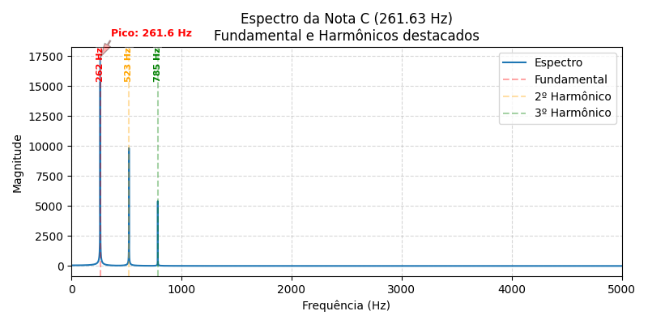   |
| Dó# (C#)    | 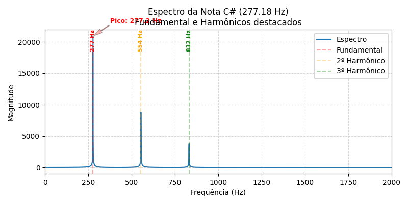  |
| Ré (D)      | 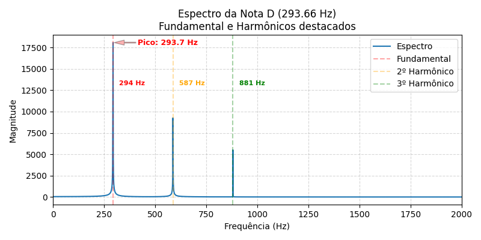   |
| Ré# (D#)    | 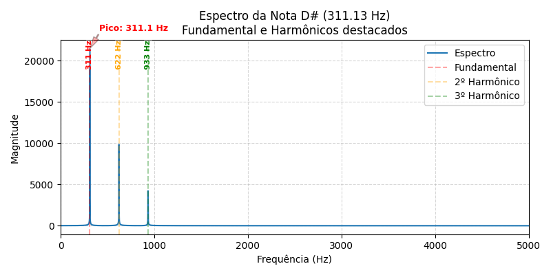  |
| Mi (E)      | 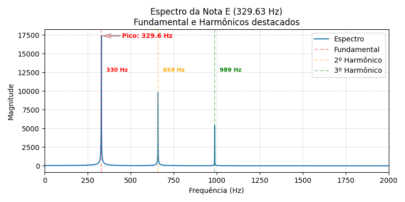   |
| Fá (F)      | 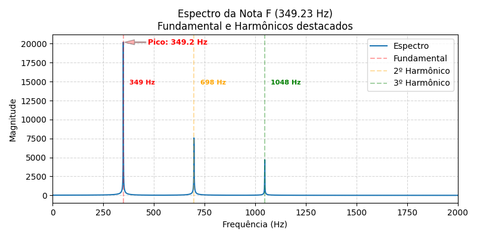   |
| Fá# (F#)    | 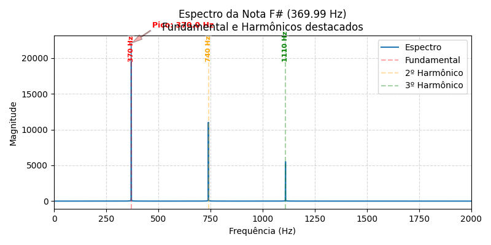  |
| Sol (G)     | 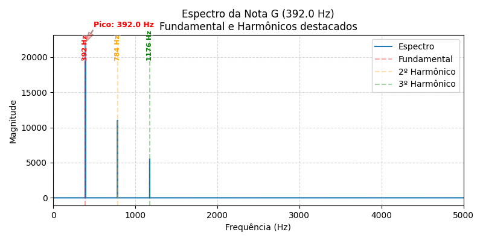   |
| Sol# (G#)   | 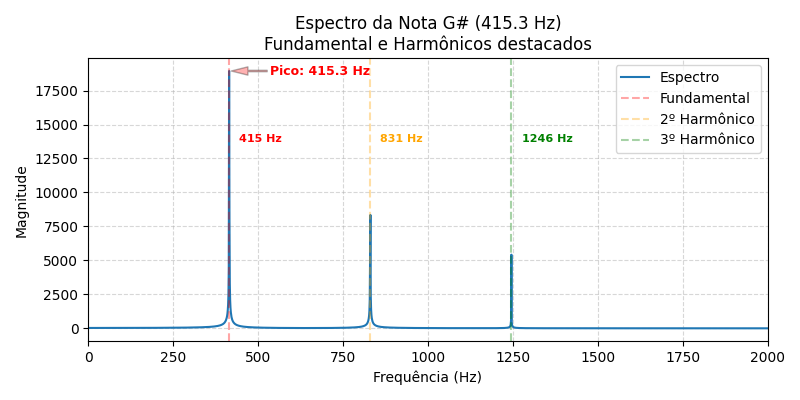  |
| Lá (A)      | 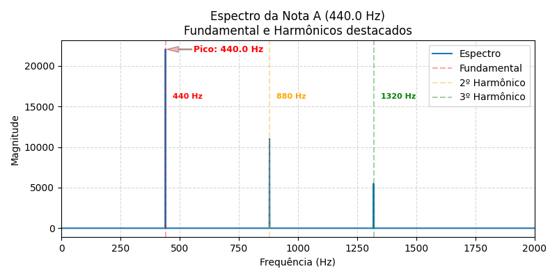   |
| Lá# (A#)    | 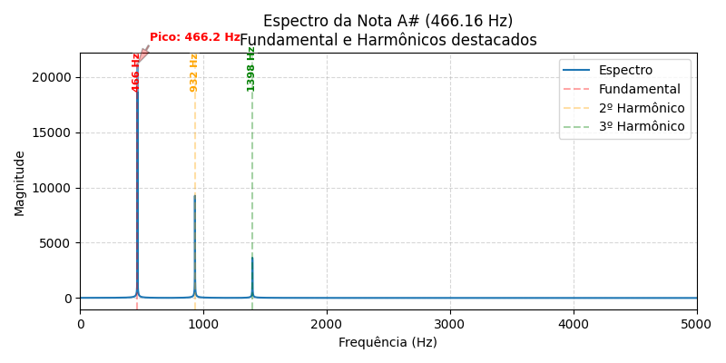  |
| Si (B)      | 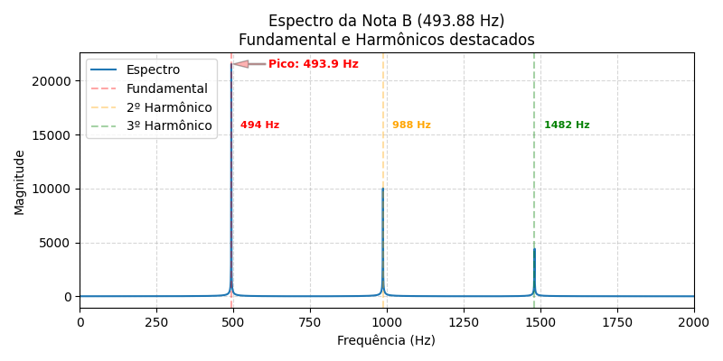   |

Cada espectro foi gerado com sinal sintético contendo harmônicos, simulando o comportamento real de instrumentos musicais.

O espectro de sinal é uma representação gráfica que mostra como a energia de um som está distribuída entre as diferentes frequências. No contexto deste projeto, ele é fundamental para identificar qual nota musical está presente no áudio captado pelo microfone.

Quando um som é capturado, ele está no domínio do tempo (variação do sinal ao longo dos segundos). Através da FFT (Transformada Rápida de Fourier), esse sinal é convertido para o domínio da frequência, revelando os componentes harmônicos e a frequência fundamental.

- **Frequência fundamental:** É o pico principal do espectro, que corresponde à nota musical predominante.
- **Harmônicos:** São múltiplos inteiros da frequência fundamental e aparecem como picos menores no gráfico. Eles dão o timbre característico de cada instrumento ou fonte sonora.

No projeto, o algoritmo busca o maior pico no espectro (após filtragem e janelamento), identifica sua frequência e faz o mapeamento para a nota musical mais próxima. Esse processo é feito em tempo real, permitindo a detecção instantânea da nota tocada ou cantada.

#### Exemplo prático:
- Se o microfone captar um som puro de 440 Hz (Lá4), o espectro mostrará um pico acentuado exatamente nessa frequência.
- Se o som for mais complexo (como uma voz ou instrumento), o espectro exibirá a frequência fundamental e vários harmônicos, mas o algoritmo sempre identifica a nota pela frequência fundamental.

---

#### ℹ️ Sobre o eixo X dos gráficos

O espectro de magnitude gerado mostra as frequências de 0 até metade da taxa de amostragem (22.050 Hz, para fs=44.100 Hz), conforme a teoria da FFT e a frequência de Nyquist. No entanto, para análise musical, apenas a faixa até 2.000 Hz é realmente relevante para a maioria dos instrumentos e vozes, pois abrange todas as notas musicais fundamentais e seus principais harmônicos. Por isso, os gráficos deste projeto são limitados a esse intervalo, facilitando a visualização dos picos e harmônicos das notas e tornando a análise mais didática.

Se desejar visualizar uma faixa maior do espectro, basta ajustar o comando `plt.xlim(0, 2000)` no script de geração para outro valor, como 5000 Hz ou até o máximo permitido pela taxa de amostragem.

